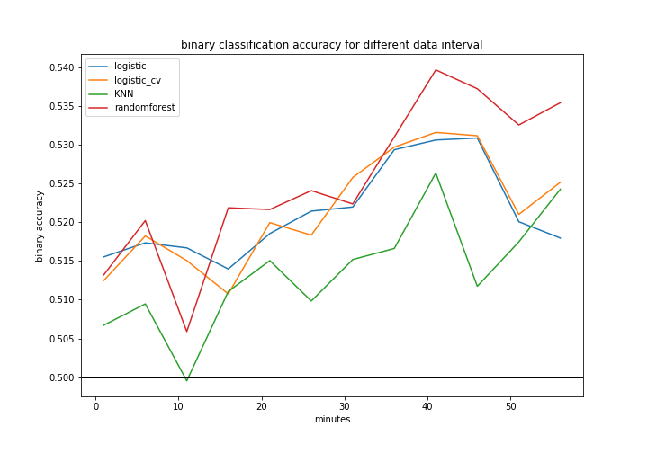
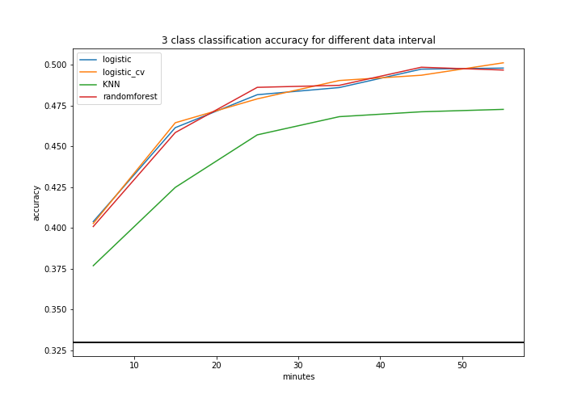

## Contents
{:.no_toc}
*  
{: toc}

## Introduction

In this section we are going to predict whether the stock market price would increase or not. As a baseline model, we would explore different models and different features.

Since we were able to obtain minute-by-minute price data of S&P500 index, we can continue our project based on the problem statement, which is to predict stock market price impact based on features extracted from Trump tweets.

## Feature selection

### Features in tweet

Each tweet has the number of favorite and the number of retweet, which we think are important features to measure the impact of this tweet.

### Top Significant Words 

We select 20 words based on Volfefe Index[2] by how frequently they appear in marketmoving tweets: 

- China
- billion
- products
- democrats
- great
- dollars
- tariffs
- country
- mueller
- border
- president
- congressman
- people
- Korea
- party
- years
- farmers
- going
- trade
- never

We use a 20-dimension one-hot vector to represent whether this tweet has the top-20 significant words. 

In the following feature importance part, we would dig deep into the feature importance of each word and to validate the use of use of these 20 words.

### Sentiment Features 

We select the results from our naive sentiment method, i.e.  using the positive and negative word counts to do the classification. The reason we do not include results from the textblob (polarity and subjectivity) approach is that those are strongly correlated with those from the naive method.

## Response Variable

We want to predict the influence of trump’s tweets on the market. Thus we extract the S&P500 index price to the nearest minute before the tweet, and the index price $m$ minutes after, $m$ is a parameter we are going to test. 

Meanwhile, we creatively add a threshold $\delta$ to the response variable construction.  That is, if the increasement and decreasement is less than a threshold, rather than classify the stock to either rise or fall, we add a middle state where the stock price "relatively unchanged". 

Mathematically speaking:

$$
\text{response variable} = 
\begin{cases}
1 & \frac {\text{price m minutes later}} {\text{price when twitter is created}}  > (1 + \delta)  \\
-1 &  \frac{\text{price m minutes later}} {\text{price when twitter is created}}  < (1 - \delta) \\
0 & \text{otherwise}
\end{cases}
$$

A good point for this definition is that when $\delta = 0$, we go back to the binary classification that there are only two classes in the dataset.

This way we can assume each row of data is roughly i.i.d. In the following sections, we will deal with simple binary classification as well as the effect of threshold. 

## Experiment Design

### Models

Since this is a classification problem, the models we are using here are:

- logistic regression without penalty
- logistic regression with cross-validation
- K nearest neighbor
- Random forest

To prevent over-fitting, we limit the max_depth of randomforest to be 20 and number of estimators to be 1000.

### Parameter design

In this experiment we have tested two sets of parameters:

| Experiment Id | $\delta$ (middle threshold)| $m$ (time interval) | 
|--|--|--|
| 0 | 0 | 5 | 
|1|0| 10 |
|2|0| 15 |
|3|0|20|
|4|0|30|
|5|0|40|
|6|0|50|
|7|0|60|
|8| 1e-4 | 5 | 
|9|1e-4| 10 |
|10|1e-4| 15 |
|11|1e-4|20|
|12|1e-4|30|
|13|1e-4|40|
|14|1e-4|50|
|15|1e-4|60|

for the cases where $\delta = 0$, it is a binary classification problem, whose random baseline should be 0.5; for the cases where $\delta = 1e-4$, it is a three class classification problem, whose random baseline should be 0.333.

### Experiment

Even if $\delta$ and $m$ are fixed, we have noticed that there is some randomness due to the train test split and model training. To better eliminate this sort of randomness, for each $\delta$ and $m$, we have done 10 times of training and use the average of accuracy on each test set as the final metric.

## Results

Below is the result for binary classification (when $\delta = 0$)

Below is the result for 3 class classification (when $\delta = 1e-4$)

## Conclusions

TODO

