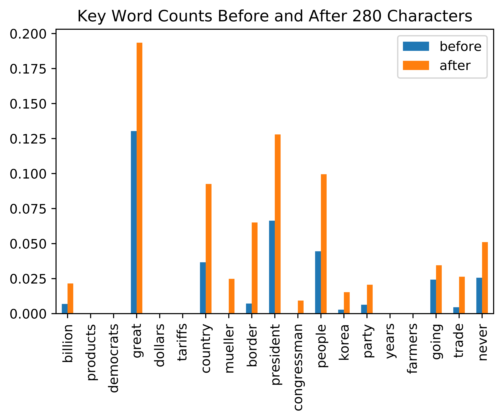
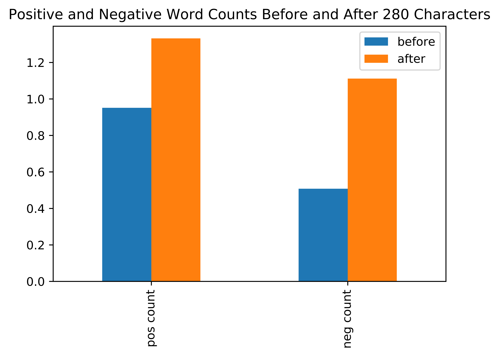

## Contents
{:.no_toc}
*  
{: toc}

## Project Trajectory 

With this project we set out hoping to extract information from Trump's tweets that are related to the movement of the financial market. Our project is divided into two parts: First, we try to predict the *direction* of the S&P500 Index, and second the actual *returns* of the Index.

In the first part, we started off doing a sentiment analysis, extracting features such as positive and negative word counts in each tweet. We also referenced J.P. Morgan's Research report and extracted 20 key words that could be impactful on the market. The baseline models we used are Logistic Regression (with CV), KNN, and Random Forest. The result was better than we thought: all of the model achieved somewhere between 52-54% accuracy on the test set. Also surprising to us at first was that as the number of minutes ahead increases, our prediction accuracy increases on average. We also looked the feature importance in our baseline model and compared with those used in J.P. Morgan Research.

Next, we employed Long Short-Term Memory (LSTM) model that takes in entire sentences. The model performed nearly as well as the baseline model, which was surprising at first. We thought hard about it and listed our comments on the corresponding page. The main points are limited tweet data and lost information/context in our representation of dataset.

Finally, we attempted to directly predict the *returns* of the S&P500 Index with the same feature set that we did fairly well in predicting the *direction*. The result was surprisingly a disappointment. The best model yielded no positive predictive power and our feature set, which is entirely based on text, did not capture the relationship with the market. In the process we were also very cautious of any data snooping, but carefully taken out features that seem to make sense but actually should not be used; examples are favorite and retweet counts as well as comments -- they may be very rich in information, but unfortunately they will never be available *ex ante*.

## Results and Interpretation

## Conclusions

## Future Improvements

1. One of the clear changes in data that is not mentioned in previous parts is related to Twitter's change of character limit. Before November 2017, each tweet was limited to 140 characters, and it was expanded to be 280 afterwards. There is clear different in the information content before and after, as illustrated in Figure2 1 and 2. The 20 key-word count as well as positive and negative words count per tweet got noticeably higher after the change. In the future, researchers might want to then add this change as a feature to control for its effect.

 

Figure 1: Key Word Count Before and After Character Limit Change

 

 

Figure 2: Positive and Negative Word Count Before and After Character Limit Change

 

2. One possible limitation of our research is that, as we discussed before, Trump’s tweets are not always posted by himself. The tweet posted by introducing more noise into the model since some studies showed that the tweet from his team would be less aggressive. One way to overcome this problem is that we could filter out the tweets that not tweeted by him. This is difficult now since Trump switches Android to iPhone nowadays so that we can no longer simply tell the difference between different sources. In the future, we could possibly use the result from http://didtrumptweetit.com/ (which is a website contains the probability the tweet is posted by Trump).