## Contents
{:.no_toc}
*  
{: toc}

## S&P500 Index Data

Since we are interested in whether we can use Trump's tweets to predict stock market movements (in our baseline model, up or down) in the first 5 minutes after each tweet, we specifically look at the up and down percentage within any non-overlapping 5-minute intervals across all data. The result is shown below. Given this, we have a pretty balanced sample, and no need to worry about our classifier predicting only one class.

<table border="1" style="margin: 0px auto;">
  <tr>
    <th>Directions</th>
    <th>Percentage</th>
  </tr>
  <tr>
    <td>Up</td>
    <td>51.26%</td>
  </tr>
  <tr>
    <td>Down</td>
    <td>48.74%</td>
  </tr>
</table>

## Trump Data Analysis

President Donald Trump is known to be a prolific Twitter user. He usually uses this platform to promote his policies and criticizes his opponents. In this section, we would analyze his behavior on Twitter from 5 perspectives: impact, frequency, interaction, language usage, and sentiment Analysis.

### Impact Analysis

We are interested in quantify his impact on Twitter by favorite counts and retweet counts. Because they are ways to show support for the posts on Twitter. 

As we can see in the figure, Trump’s tweets did not have strong impact on Twitter during 2009-2015. But after he started his campaign and subsequently became president, his Tweets’ retweets and favorite counts has been significantly increased. His tweets are retweeted around 20,000 times and have been marked as favorite 80,000 times per month on average.

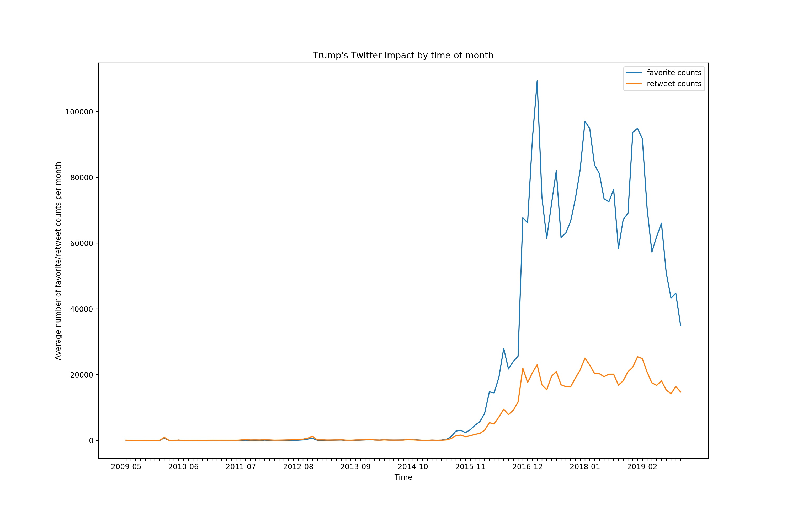

### Frequency Analysis

From the figure above, we know that Donald is surprisingly active on Twitter at almost any hour of the day. Most of Trump’s tweets are sent during 11:00 AM to 2:00 PM, and the number of tweets at 12:00 PM - 1:00 PM is about three times that of other times. Also, Trump’s activity has increased substantially through 2019. A curious observation is that Trump is also very active at 3:00 AM. Additionally, an interesting finding is that 5:00-9:00 AM seems to be his sleeping time since there is rarely any tweet posted during that period.

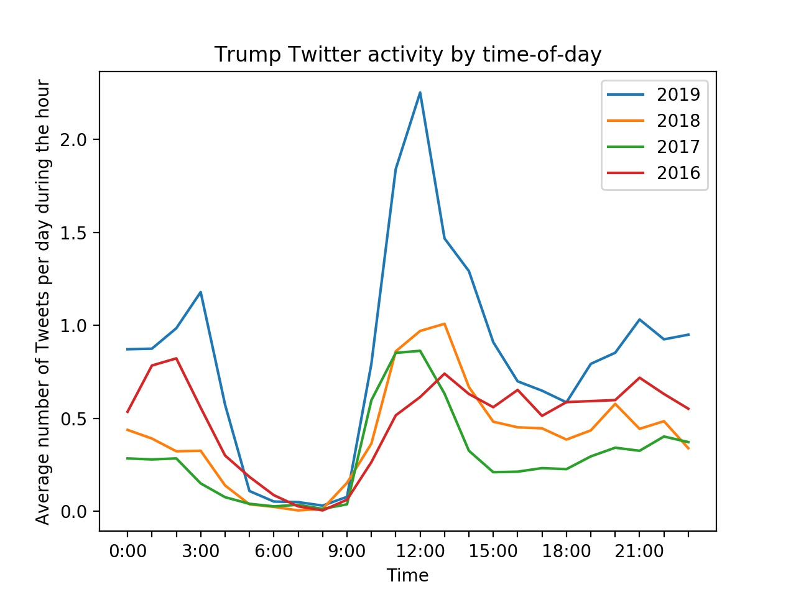

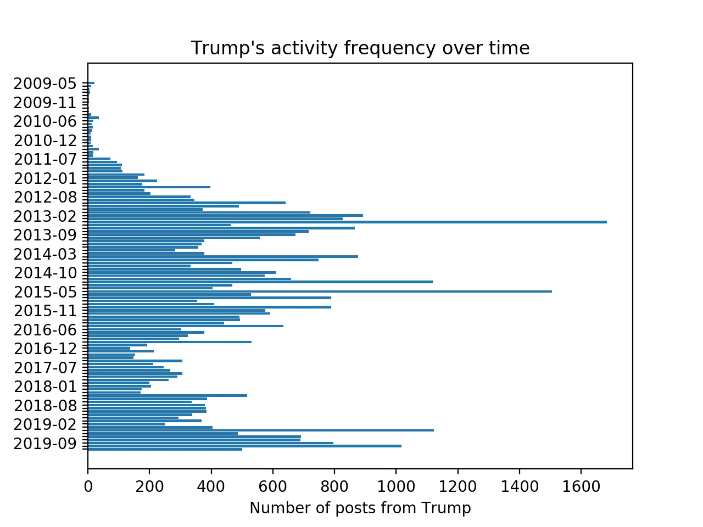

Trump has 3 major sources to post his tweets, web, iPhone, and Android. In our data-set, 33\% of tweets are from iPhone, 34\% of tweets are from Android, 28\% of tweets are from the web. Most of the tweets from web client were posted early so that we only focus on the Android and iPhone.

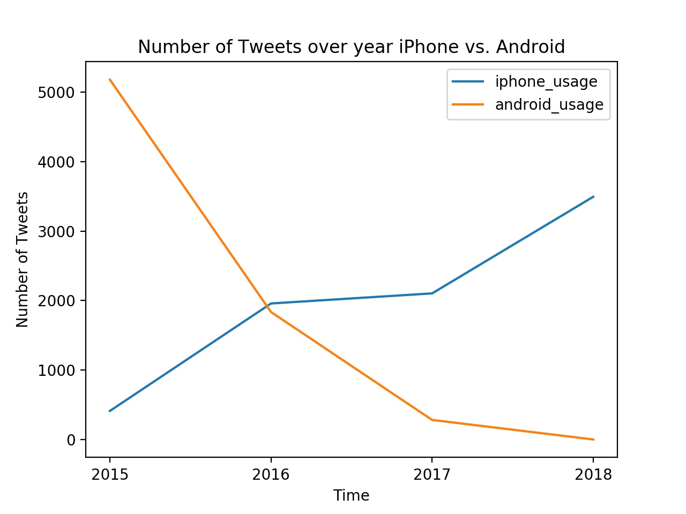

Based on Figure above, we can see that Trump switched to iPhone after 2017 so that we could no longer use the device to tell the difference between himself and the team. The account's last post from Android was on Mar 25, 2017, 09:41:14 AM, and there are no other Android tweets from then on.

Consensus has that part of Trump's tweets is not written by himself but his team. The problem is that it is hard to tell who is the person behind each tweet. An analysis proposed by David Robinson showed that there was a clear difference between the tweets from Android and iPhone and the Android tweets are angrier and more negative. He concluded that Trump's staff's tweets are from iPhone, and Trump himself uses Android.

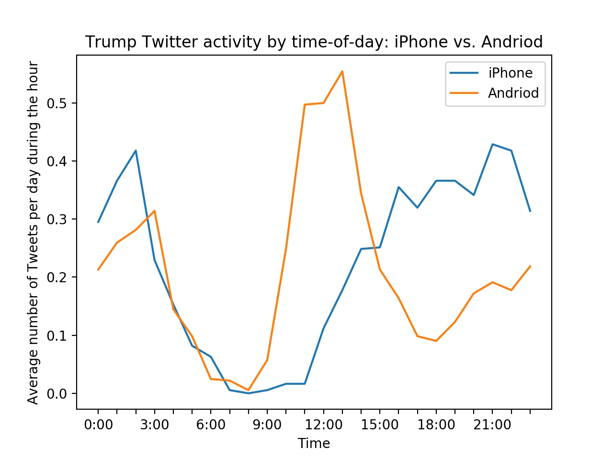

In 2016, similar to David Robinson's conclusion, there is a significant usage difference between tweets from Android and iPhone. Tweets from Android are more active at noon while Tweets from the iPhone are more active during the night.

### Interaction Analysis

From EDA we know that 7.5% of Trump’s tweet are from retweet, which shows that Trump still writes most of his tweets by himself. Accounts Trump likes to retweet include himself, his colleagues (@WhiteHouse, @GOPChairwoman, @Scavino45 (His Assistant), @TeamTrump (Trump Campaign)) and his family (@IvankaTrump (daughter), @EricTrump (son)). Accounts Trump likes to mention also includes some popular media, such as Fox News, CNN, and also President Obama. As we can see, Trump talks a lot about his policies and work on Twitter which makes our study possible.

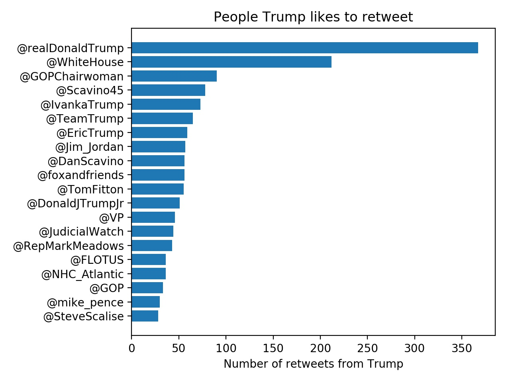

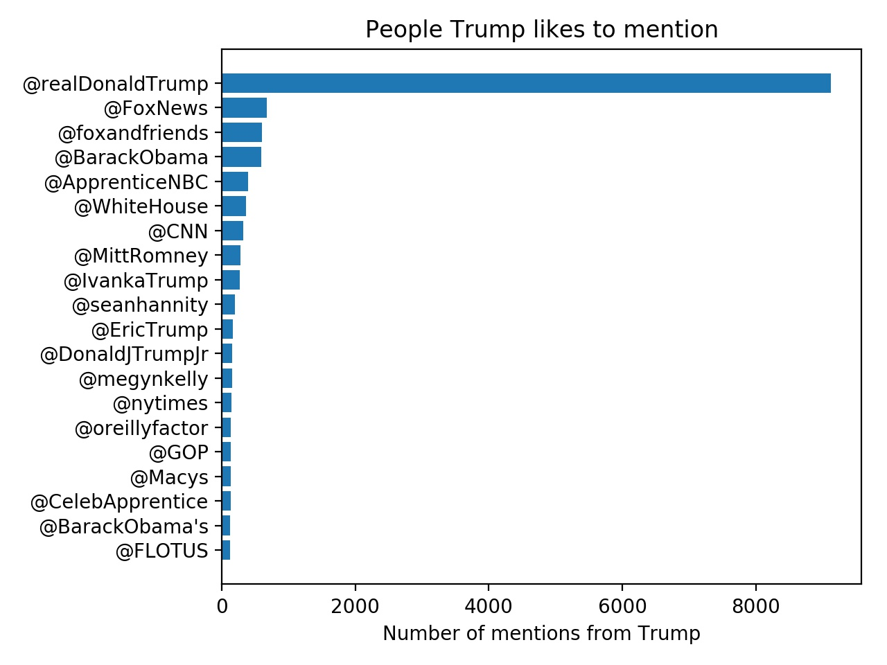

### Language Analysis

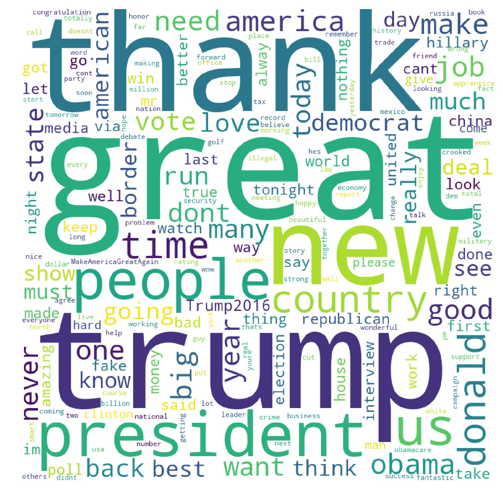

Above is the word cloud of Trump's most frequently used word, as we can see in the graph, Trump loves to use the word great, thank and trump.

CNN pointed out that Trump commonly made spelling mistakes and he even misspelled his wife's name on Twitter. Hence, we are curious to see what misspellings he made on Twitter in our dataset. In this study, because there is no standard spell checker tool that can achieve satisfactory performance on detecting whether a word is correct, we use a list of common misspellings containing 2239 words from Wikipedia and see if Trump's Twitter word matches a misspelling in it.

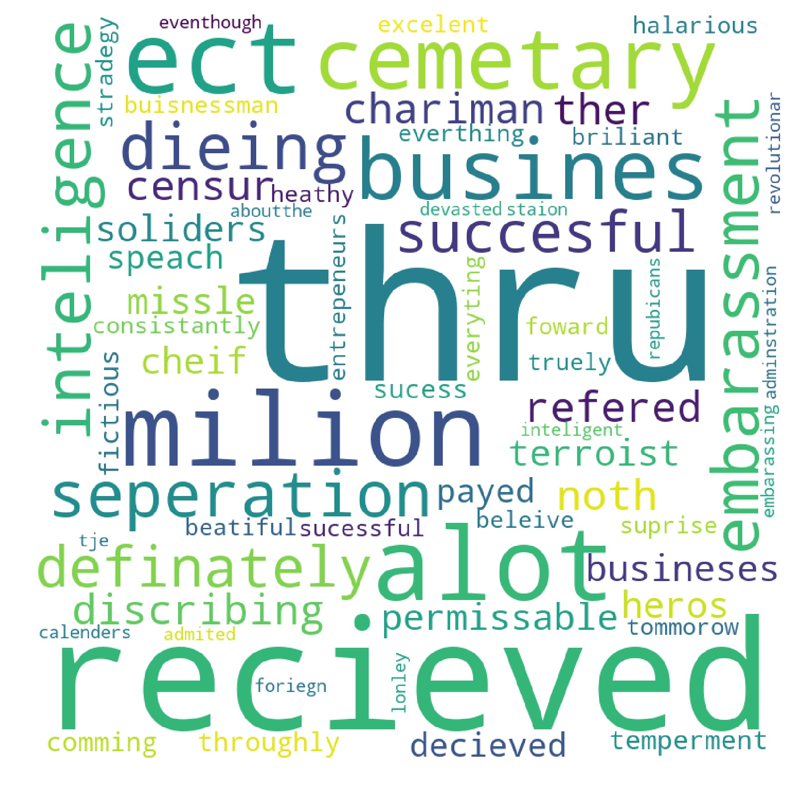

The figure above is a word cloud that shows Trump's favorite misspelling, it seems that Trump misspelled 'received' to 'recieved' a lot times.

### Sentiment Analysis

An useful analysis for the text data is sentiment analysis, which could infer the attitude and subjectivity from the text. Here we have tried two ways to perform sentiment analysis: a naive approach and a package-based approach. 

For the naive approach, we download the positive word and negative word dictionaries from publicly available sources and count the number of positive words and negative words in a single twitter. And then the sentiment is defined as follows:

$$
    score = \text{positive counts} - \text{negative counts}
$$

$$
    \text{sentiment} = \begin{cases}
    \text{positive} & score > 0 \\
    \text{neutral} & score = 0 \\
    \text{negative} & score < 0
    \end{cases}
$$

For the package-based approach, we use the the package [textblob](https://textblob.readthedocs.io/en/dev/), which can output a polarity and a subjectivity. Mapping of positive or negative outputs correspond exactly to Equation above.

#### Comparison between naive and package solution

We construct a confusion matrix for the given sentiment output with two approaches to see their difference.

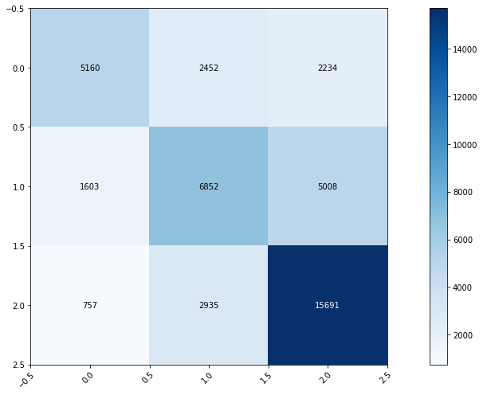

We can see that the two approaches are highly correlated. In the following parts we just explore the features based on the naive approach.

#### Exploration on Sentiment

We take a look at the kinds of positive and negative words Trump uses the most:

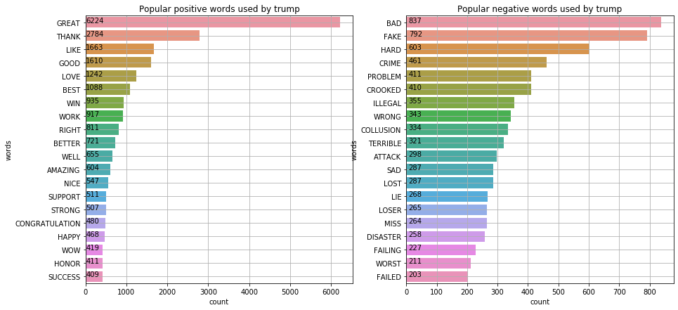

It seems that Trump tends to use simple words (maybe due to his main audience), and the most popular words are "great", "thank", "bad" and "fake".

Then let us see how Trump's attitude change over the course of an average day:

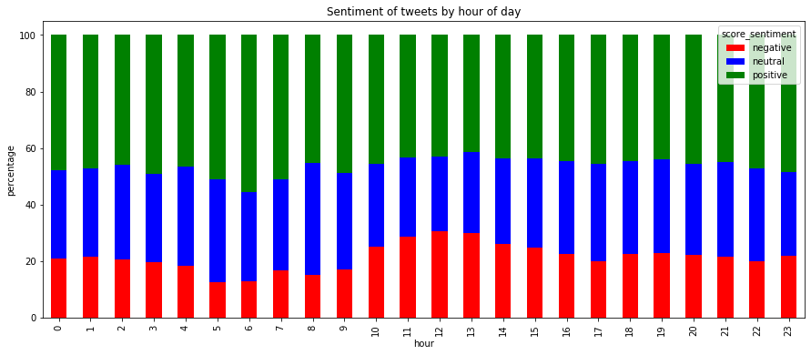

It seems that there is no huge difference within a given day, the only difference would be that maybe Trump say more negative words at noon.

Lastly we want to see if the sentiment of tweets affects the favorite counts and retweet counts:

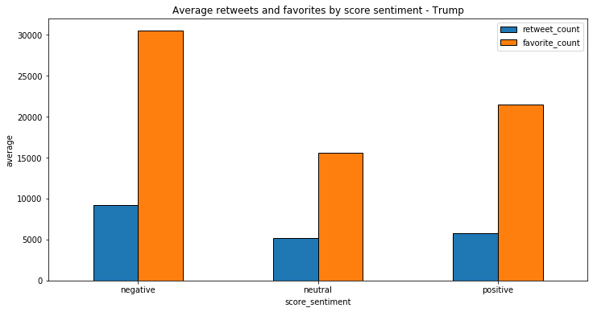

Average favorite and retweets counts by sentiment

We can tell from figure above that the neutral tweets have the least amount of retweets and favorites, while the negative ones have the most, which makes sense since people tend to comment and watch more controversial topics rather then the milder ones.

