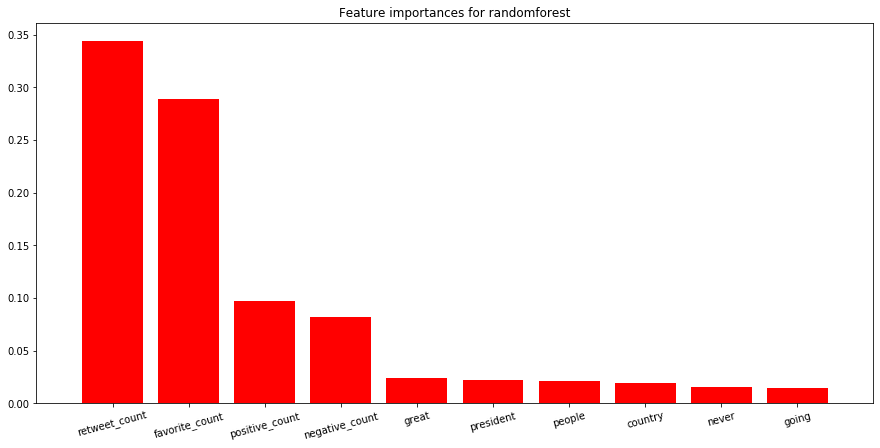
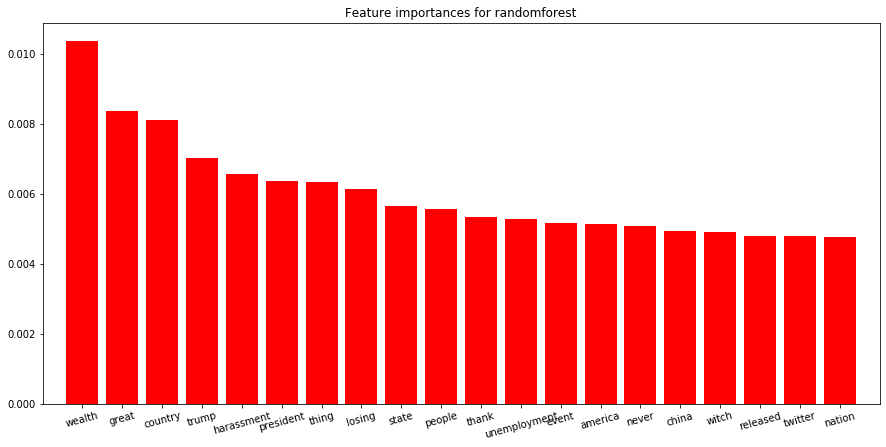
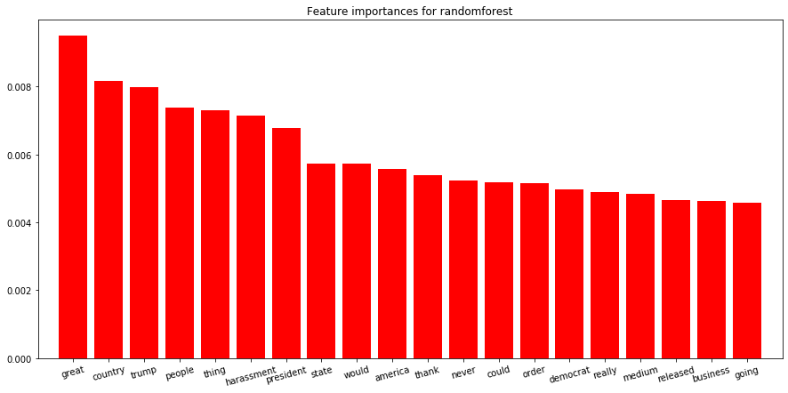

## Contents
{:.no_toc}
*  
{: toc}

## Introduction

In this section we are going to use random forest and tree methods to see the feature importance in this problem set.

We use feature importance from of each predictor in this random forest model. Whenever a feature is used in a tree in the forest, the algorithm will log the decrease in the splitting criterion (such as gini) and make use of this splitting criterion as a metric to meature the importance of variables.

## Results

### On all features

From the figure above we can notice that the most important features when deciding whether the stock should go up or down is the favorite numbers, retweet numbers and the positive/negative counts we gain during the sentiment analysis. 

There are two reasons behind this phenomenon. Firstly, the number of rtweet and the number of favorites leaks some future information (as dicussed in the conclusion), so they must be powerful in this case. On the other hand, since we are using the one hot encoding and using the splitting criterion to evaluate the importance of the variables, it is not fair to compare a single word with other features. The single word is sparse in the all dataset which means that it is more likely to obtain low feature importance.

### On different words

Base on the discovery above, it is worth looking at the importance for different words separately. Here we build the model solely for single words to see their variable importance. 

In the previous baseline model part we are using research result word lists ( i.e. china, great, etc) to do the classification. Here it is worth looking at the difference with our model and their research results. 

Our results for binary classification and 3 classification are as follows:

### Comparison with JPmorgan word list

Here we print out top20 important words for both binary and 3 classifications. And then compare the words with the one we obtained from JPmorgan. The results is as follows:

| J. P. Morgan wordlist | randomforest binary classification wordlist | randomforest 3 classification wordlist |
|-------------------|---------------------------------------------|----------------------------------------|
| china             | wealth                                      | **great**                                 |
| billion           | **great**                                       | **country**                           |
| products          | **country**                                     | trump                                  |
| democrats         | trump                                       | **people**                                |
| great             | harassment                                  | thing                                  |
| dollars           | **president**                                   | harassment                             |
| tariffs           | thing                                       | **president**                              |
| country           | losing                                      | state                                  |
| mueller           | state                                       | would                                  |
| border            | **people**                                   | america                                |
| president         | thank                                       | thank                                  |
| congressman       | unemployment                                | **never**                                  |
| people            | event                                       | could                                  |
| korea             | america                                     | order                                  |
| party             | **never**                                     | democrat                               |
| years             | **china**                                     | really                                 |
| farmers           | witch                                       | medium                                 |
| going             | released                                    | released                               |
| trade             | nation                                      | business                               |
| never             | **trade**                                       | going                                  |

We bold the overlapped words to clarify the results. We notice that all the methods have point out that some words like "great", "people", "president", "country" to among top importance. This just justifies that our results correspond to the one with J.P. Morgan, which is also a signal that our method is correct and valid.

