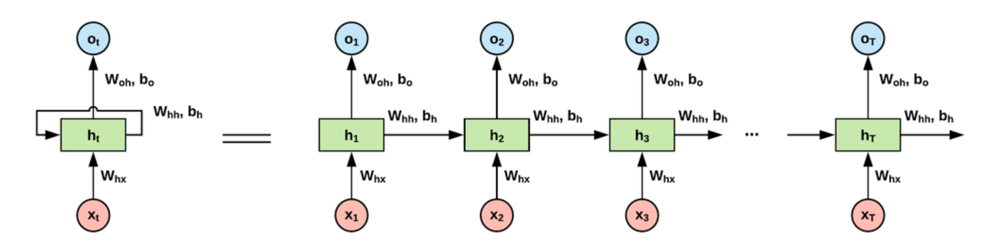
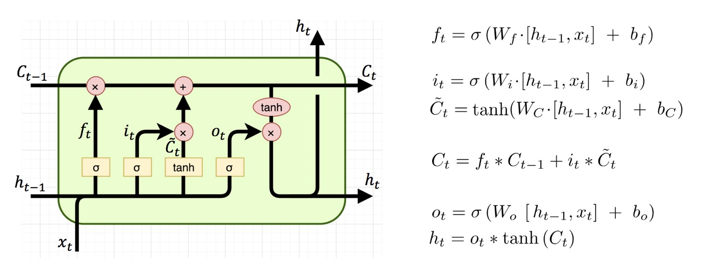
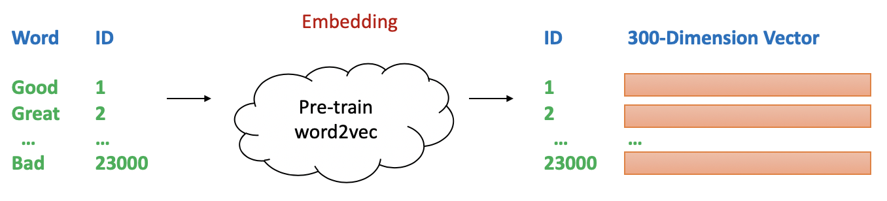
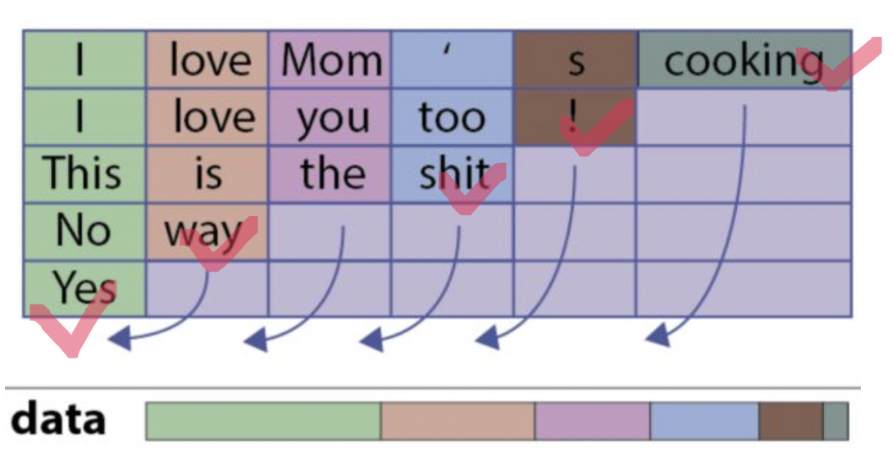
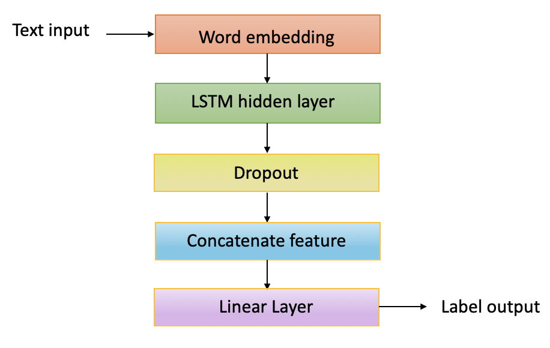
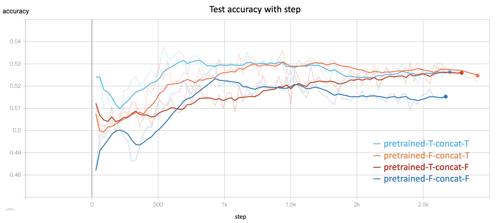
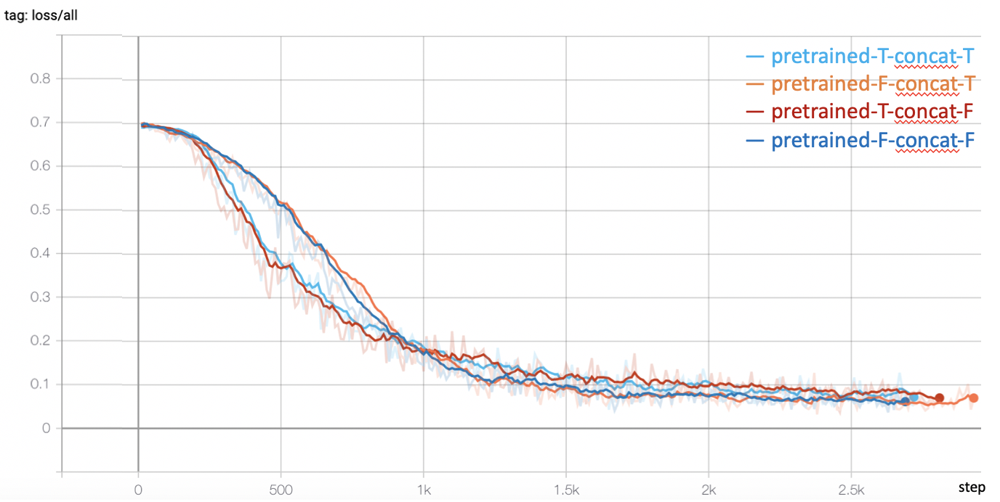

## Contents
{:.no_toc}
*  
{: toc}

## Introduction 

Based on our exploration in our baseline models, we find it is difficult to manully extract features with strong expression ability. The selected fetaure may ignore some potential information in the tweets which limited the model performance. Nowadays, deep learning, especially Recurrent Neural Networks (RNN), has achieved excellent performance in text classification. Thus, we further explore this task using RNN to compose low-level lexical features into high-level semantic concepts for the automatic summarization of texts. In this section, we moved our focus from designing features to designing network architectures.

### Recurrent Neural Networks
Recurrent Neural Networks are good at modeling sequence data, achieving excellent performance in Natural Language Processing field. When humans read sentences, they understand each word based on the understanding of previous words. Traditional neural networks can not handle this but RNN breaks through the limitation.  

In the diagram, a chunk of neural network, $h_{t}$, takes input $x_{t}$ and outputs a value $o_{t}$. A loop allows information to be passed from one step of the network to the next. Actually, $o_{1}, o_{2}, ..., o_{\tau}$ are the output of hidden layers and we will get the final output label from the last hidden layer. 

Fig 1: A clasical RNN structure 

### Long Short-Term Memory
RNN often suffers from the situation when the gap between the relevant information and the needed point is really large. That means RNN is not capable of handling such “long-term dependencies”.

Long Short Term Memory network (LSTM) is a special kind of RNN, which has the competence to learn long-term dependencies. 

All RNNs have the form of a chain of repeating modules ($h$ in Fig 1) of neural network. In standard RNNs, thie module is simple with a single tanh layer.

LSTM has four layters, interacting in a special way as showing in Fig 2. The key idea is the cell state (the horizontal line going through the top of the module). It will remove or add information to the cell state, regulated by gate structuress.

Fig 2: The repeating module in an LSTM 

- First, a sigmoid layer called the “forget gate layer” decide what information to throw away from the cell state. 
- Second, LSTM decides what new information to store in the cell state. A sigmoid layer called the “input gate layer” decides which values to update. A tanh layer creates a vector of new candidate values, that could be added to the state.
- Third, update the old cell state $C_{t−1}$ to new state $C_{t}$. LSTM multiply the old state by $f_{t}$ (forgetting the things) and we add $i_{t} * \tilde{C}_{t}$ (the new candidate values).
- Finally, decide what to output combining with sigmoid and tanh. A sigmoid layer which decides what parts of the cell state to output. Then, the cell state through tanh and multiply it by the output of the sigmoid gate, thus only output the parts we decided to.

## Implementation 

We use Pytorch to establish our LSTM model and use tensorboard to visualize our training process. 

The input of lstm model should be a sequence of numerical data. So we should map words to vectors and pad each tweet to same length.
### Word embedding

Word embedding is to compute vector representations of words. To better build our model, a pre-trained Google News corpus (3 billion running words) word vector model (3 million 300-dimension English word vectors) was used as our initial vector representation of the word in tweets. These vector weights will also be update at the following training process. We follow the setting of 300 embedding dimension that Google News choosed.

Fig 3. word to vector using Google News model.

### Sentence padding
Different tweets have different length. Thus, we should pad short sentences to the longest sentences. Or a more reasonable way is to set a hyper-parameter as the max sample length, which reduces the modeling complexity. When the sentence is shorter than max length, we pad it. When the sentence is longer than max length, we throw the exceed part. However, this causes a problem. For example, in the figure below, the sentence "Yes" only has one word, but padding it to length 5 will cause the representation of LSTM includes a lot of useless padding characters. So the sentence representation will have mistakes. The right way to do it is only get the representation of LSTM after word 'yes' as marked with a red check mark, not after several unmeaningful 'pad' word.

 

Fig.4 Sentence padding and get the output in resonable position 

### Model structure
Our main network stucture are as follows:
First, we do word embedding to get the word representations and then fit them into LSTM units (as we mentioned in Introduction part). We add dropout to alleviate the overfit problem. To fully utilize the information of each tweet, we concatenate the retweet and favorite count as two additional features into the   output from LSTM layer (We compared the results with not concatenating additional features in Abalation study part). Last we use a linear layer to get the output as our predicted label.

For loss function, we use cross entropy, which is common for classification problem:

$L = - \frac{1}{N} \sum y_{i} log(p(y_{i})) + (1-y_{i})log(1-p(y_{i})),$

where y is the label (1 for up and 0 for down) and p(y) is the predicted probability of the sample.
 

 

Fig.5 Overall network structure 

### Important Hyper-parameter

We have several hyper-parameters that may influence our training results. Based on experiences and experiments. We get the best parameters as follow:

|  Name   | Setting | Explain |
|  ----  | ----  | ---- |
| MAX_VOCAB_SIZE | 10,000 | Trump has used more than 20,000 words. When map word to id in dictionary, we select the top k frequency word he used|
| USE_PRETRAINED_EMBEDDING | True | Use pre-trained embedding by Google News or not|
| CONCAT_RETWEET_AND_FAV | True | Concatenate retweet and favorite count into LSTM output or not |
| MAX_SAMPLE_LENGTH | 50 | The length to pad the tweet or crop the tweet|
| EMBED_DIM | 300 | The dimension of word embedding. Set to 300 according to pre-trained Google News embedding |
| HIDDEN_DIM | 128 | The dimension of hiden layer in LSTM |
| DROPOUT_RATE | 0.5 | The rate of dropout and set according to empirical value|
| NUM_LAYERS | 1 | The number of layers in LSTM. Set to 1 becasue our dataset is not large and we want to make the model not so complex |
| NUM_EPOCH | 100 | The epoch we trained for the model. Most cases the model loss levels off when epcoh is 100 |
| BATCH_SIZE | 256 | Large batch size makes the model converge quickly but may cause the model stuck into local minimum |
| LEARNING_RATE | 0.0003 | Small learning rate makes the model converge slowly but large learning rate may misguide the model |
| LEARNING_RATE_DECAY| decay 0.8 per 10 epochs | When the model become more close to global minimum, we should decay the learning rate |

Tab.1 Important parameters in the model  

## Results

### Ablation study

To justify our model, we do ablation study for whether using pre-trained embedding by Google News or not and whether concatenate retweet and favorite count into LSTM output or not. We use 5 minitue interval data and keep other parameters same with the best parameter. The test accuracy comparison are showing as below:

<table class="tg">
  <tr>
    <th class="tg-lboi"></th>
    <th class="tg-lboi">Concat features True</th>
    <th class="tg-lboi">Concat features False</th>
  </tr>
  <tr>
    <td class="tg-lboi">Pre-trained True</td>
    <td class="tg-9wq8">52.95%</td>
    <td class="tg-9wq8">52.63%</td>
  </tr>
  <tr>
    <td class="tg-0pky">Pre-trained Flase</td>
    <td class="tg-c3ow">52.71%</td>
    <td class="tg-c3ow">51.38%</td>
  </tr>
</table>
Tab.2 Comparison of using pre-trained embeddings and concatenating features.

Fig.6 Test accuracy comparison with training step 

Fig.7 Loss comparison with training step 

#### Result Analysis
- **Using pre-trained embeddings and concatenating features is better.** We can see from the accuracy plot, the best result is both using pre-trained embeddings and concatenating retweet and favorite counts. This makes sense, because Google News vocabulory is close to Trump's tweets, which gives our model good initial weights for word embedding. And intuitively the retweet and favorite counts shows the influence of the tweets in some extent.
- **Concatenating two features makes model not stable.** Seeing from the test accuracy plot, it fluctuate more violetly when concatenate two features in the early training process.
- **Using pre-trained models makes model converge quickly.** Seeing from the loss plot, the loss goes down more quickly when using pre-trained embeddings.

### Interval Comparison

At first, we compare our model using 5 minute interval after the created time of the tweets. We also trained our model using 10, 15, 20, 30, 40 intervals to compare our model performance.

Fig.8 Test accuracy and loss with training step for different time intervals 

<table class="tg">
  <tr>
    <th class="tg-0pky">Time interval</th>
    <th class="tg-0pky">5 min</th>
    <th class="tg-0pky">10 min</th>
    <th class="tg-0pky">15 min</th>
    <th class="tg-0pky">20 min</th>
    <th class="tg-0pky">30 min</th>
    <th class="tg-0pky">40 min</th>
  </tr>
  <tr>
    <td class="tg-0pky">Test accuracy</td>
    <td class="tg-0pky">52.95%</td>
    <td class="tg-0pky">53.82%</td>
    <td class="tg-0pky">53.31%</td>
    <td class="tg-0pky">55.28%</td>
    <td class="tg-0pky">50.92%</td>
    <td class="tg-0pky">53.22%</td>
  </tr>
</table>
Tab.3 Test accuracy with step for different time intervals.

The loss trends of different intervals seem very similar but the accuracy is a little bit different. That because some interval like 20 minute may better shows the influence of Trump's tweets for the market. When interval is small, market may have no time to response. When interval is large, the change of market may include many noise caused by other aspects.

