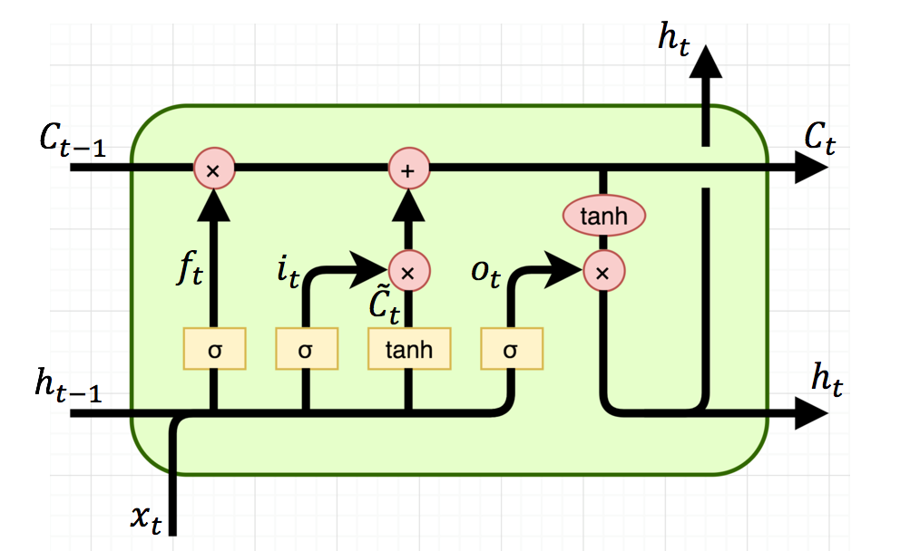

## Contents
{:.no_toc}
*  
{: toc}

## Introduction 

Automatic text classification can be done in many different ways in machine learning as we have discussed and showed before. We also explore the task using deep learning models.

### Recurrent Neural Networks
Recurrent Neural Networks (RNN) are good at modeling sequence data, achieving excellent performance in Natural Language Processing field. When humans read sentences, they understand each word based on the understanding of previous words. Traditional neural networks can not handle this but RNN breaks through the limitation.  

In the diagram, a chunk of neural network, $h_{t}$, takes input $x_{t}$ and outputs a value $o_{t}$. A loop allows information to be passed from one step of the network to the next. Actually, $o_{1}, o_{2}, ..., o_{\tau}$ are the output of hidden layers and we will get the final output label from the last hidden layer. 

Fig 1: A clasical RNN structure 

### Long Short-Term Memory
RNN often suffers from the situation when the gap between the relevant information and the needed point is really large. That means RNN is not capable of handling such “long-term dependencies”.

Long Short Term Memory network (LSTM) is a special kind of RNN, which has the competence to learn long-term dependencies. 

All RNNs have the form of a chain of repeating modules ($h$ in Fig 1) of neural network. In standard RNNs, thie module is simple with a single tanh layer.

LSTM has four layters, interacting in a special way as showing in Fig 2. The key idea is the cell state (the horizontal line going through the top of the module). It will remove or add information to the cell state, regulated by gate structuress.

Fig 2: The repeating module in an LSTM 

- First, a sigmoid layer called the “forget gate layer” decide what information to throw away from the cell state. 
- Second, lstm decides what new information to store in the cell state. A sigmoid layer called the “input gate layer” decides which values to update. A tanh layer creates a vector of new candidate values, that could be added to the state.
- Third, update the old cell state $C_{t−1}$ to new state $C_{t}$. Lstm multiply the old state by $f_{t}$ (forgetting the things) and we add $i_{t} * \tilde{C}_{t}$ (the new candidate values).
- Finally, decide what to output combining with sigmoid and tanh.

## Model Implementation 

## Experiment Result

### Comparison

### Ablation study
