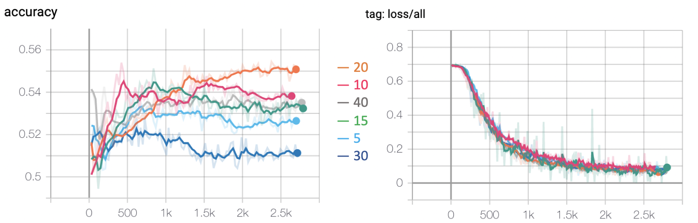

## Contents
{:.no_toc}
*  
{: toc}

## Introduction 

Automatic text classification can be done in many different ways in machine learning field as we have showed before. We also explore the task using deep learning models.

### Recurrent Neural Networks
Recurrent Neural Networks (RNN) are good at modeling sequence data, achieving excellent performance in Natural Language Processing field. When humans read sentences, they understand each word based on the understanding of previous words. Traditional neural networks can not handle this but RNN breaks through the limitation.  

In the diagram, a chunk of neural network, $h_{t}$, takes input $x_{t}$ and outputs a value $o_{t}$. A loop allows information to be passed from one step of the network to the next. Actually, $o_{1}, o_{2}, ..., o_{\tau}$ are the output of hidden layers and we will get the final output label from the last hidden layer. 

Fig 1: A clasical RNN structure 

### Long Short-Term Memory
RNN often suffers from the situation when the gap between the relevant information and the needed point is really large. That means RNN is not capable of handling such “long-term dependencies”.

Long Short Term Memory network (LSTM) is a special kind of RNN, which has the competence to learn long-term dependencies. 

All RNNs have the form of a chain of repeating modules ($h$ in Fig 1) of neural network. In standard RNNs, thie module is simple with a single tanh layer.

LSTM has four layters, interacting in a special way as showing in Fig 2. The key idea is the cell state (the horizontal line going through the top of the module). It will remove or add information to the cell state, regulated by gate structuress.

Fig 2: The repeating module in an LSTM 

- First, a sigmoid layer called the “forget gate layer” decide what information to throw away from the cell state. 
- Second, LSTM decides what new information to store in the cell state. A sigmoid layer called the “input gate layer” decides which values to update. A tanh layer creates a vector of new candidate values, that could be added to the state.
- Third, update the old cell state $C_{t−1}$ to new state $C_{t}$. LSTM multiply the old state by $f_{t}$ (forgetting the things) and we add $i_{t} * \tilde{C}_{t}$ (the new candidate values).
- Finally, decide what to output combining with sigmoid and tanh. A sigmoid layer which decides what parts of the cell state to output. Then, the cell state through tanh and multiply it by the output of the sigmoid gate, thus only output the parts we decided to.

## Model Implementation 

We use Pytorch to establish our LSTM model and use tensorboard to visualize our training process. 

The input of lstm model should be a sequence of numerical data. So we should map words to vectors and pad each tweet to same length.
### Word embedding
Word embedding is to compute vector representations of words. To better build our model, a pre-trained Google News corpus (3 billion running words) word vector model (3 million 300-dimension English word vectors) was used as our initial vector representation of the word in tweets. These vector weights will also be update at the following training process. We follow the setting of 300 embedding dimension that Google News choosed.

Fig 3. word to vector using Google News model.

### Sentence padding
Different tweets have different length. Thus, we should pad short sentences to the longest sentences. Or a more reasonable way is to set a hyper-parameter as the max sample length, which reduces the modeling complexity. When the sentence is shorter than max length, we pad it. When the sentence is longer than max length, we throw the exceed part. However, this causes a problem. For example, in the figure below, the sentence "Yes" only has one word, but padding it to length 5 will cause the representation of LSTM includes a lot of useless padding characters. So the sentence representation will have mistakes. The right way to do it is only get the representation of LSTM after word 'yes' as marked with a red check mark, not after several unmeaningful 'pad' word.

 

Fig.4  

### LSTM structure

 

Fig.5  

### Important Hyper-parameter

TODO:

|  Name   | Setting | Explain |
|  ----  | ----  | ---- |
| MAX_VOCAB_SIZE | 10,000 | Trump has used more than 20,000 words. When map word to id in dictionary, we select the top k frequency word he used by NLTK|
| USE_PRETRAINED_EMBEDDING | | |
| CONCAT_RETWEET_AND_FAV | | |
| MAX_SAMPLE_LENGTH | | |
| EMBED_DIM | | |
| HIDDEN_DIM | | |
| DROPOUT_RATE | | |
| NUM_LAYERS | | |
| NUM_EPOCH | | |
| LEARNING_RATE | | |
| LEARNING_RATE_DECAY| | |

Tab.1  

## Experiment Result

### Ablation study

Fig.6  

| | Concat Features True | Concat Features False |
| ---- | ---- | ---- |
| **Pre-trained True** | 52.95% | 52.63% |
| **Pre-trained False** | 52.71% | 51.38% |

Tab.2  

Fig.7  

TODO:
### Comparison
TODO:

Fig.8  

| ---- | ---- | ---- | ---- | ---- | ---- | ---- |
| **Time interval** | 5 min | 10 min | 15 min | 20 min | 30 min | 40 min |
| **Test accuracy** | 52.95% | 53.82% | 53.31% | 55.28% | 50.92% | 53.22% |

Tab.3  
